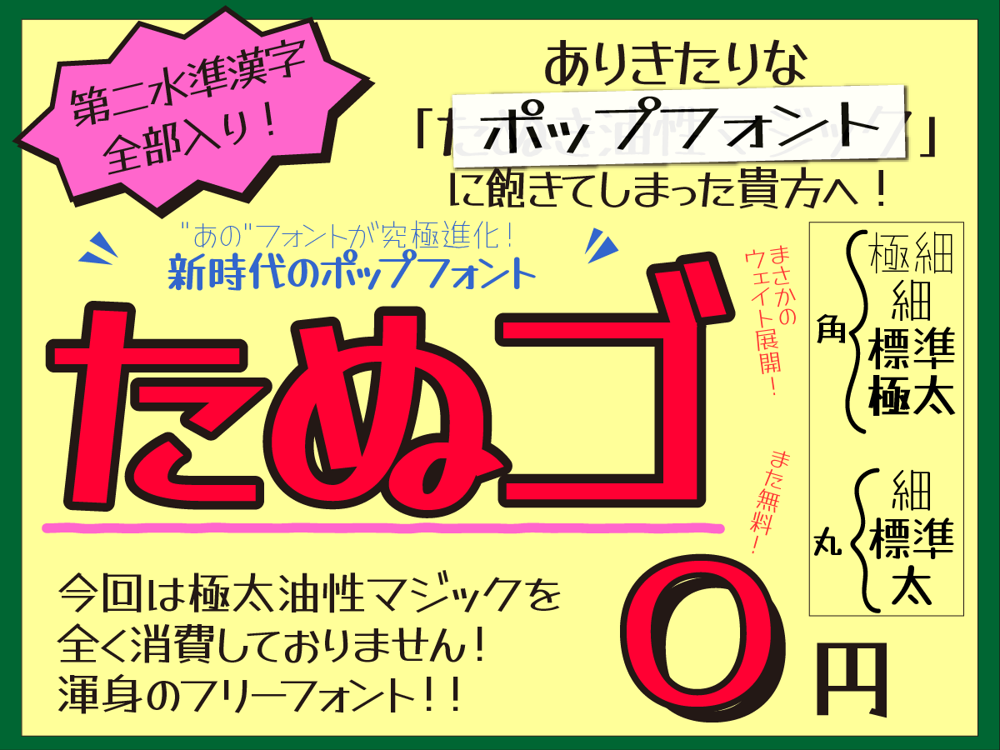
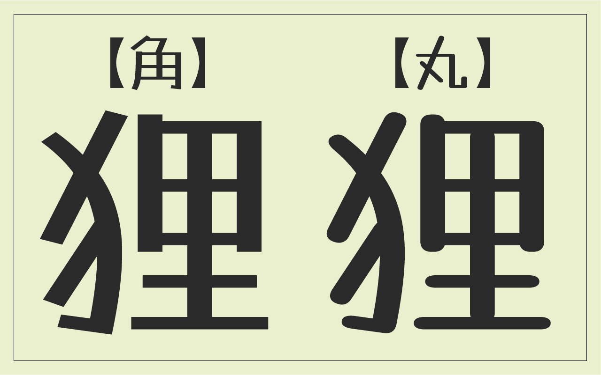
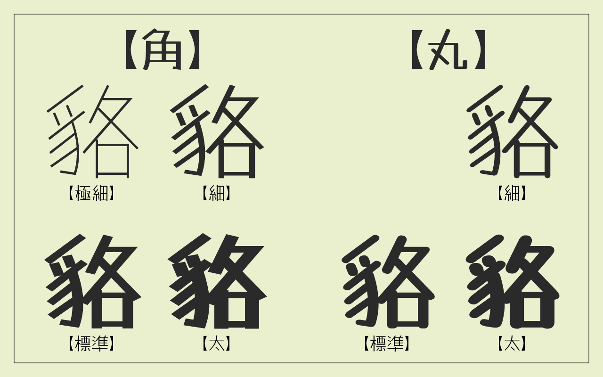
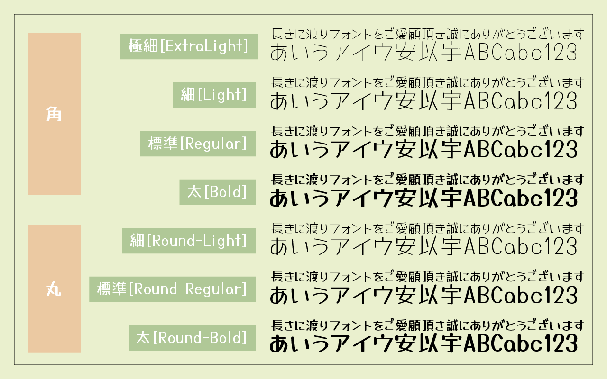
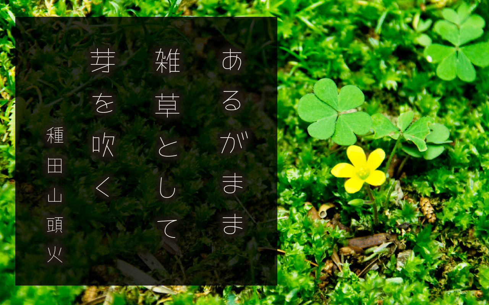

## はじめに
こちらはSIL Open Font Licenseフォント『たぬゴ』の開発用リポジトリです。
『たぬゴ』は、Google Fonts から支援を受けて制作したフォント『Yusei Magic』を改変し、新たにLightウェイトや角グリフを追加して作成したフォントです。
従いまして『Yusei Magic』の派生フォントとなります。
ライセンスも『Yusei Magic』と同様に[SIL Open Font License（SILオープンフォントライセンス）](https://licenses.opensource.jp/OFL-1.1/OFL-1.1.html)を継承しています。
SIL Open Font Licenseの詳細については後述いたしますが、非常に緩やかなライセンスで、商用利用においても幅広くご活用いただけるフォントです。

## 『たぬゴ』公式URL
[https://tanukifont.com/tanugo/](https://tanukifont.com/tanugo/)

## ダウンロード方法
以下のいずれかの方法でフォントファイルを入手できます。

- **公式サイトからダウンロード**:  
  [たぬきフォント『たぬゴ』配布ページ](https://tanukifont.com/tanugo/) より最新版をダウンロードできます。
- **本リポジトリからダウンロード**:  
  本リポジトリ内の [release/Tanugo_1_10.zip](release/Tanugo_1_10.zip)（最新版 v1.10）または [release/](release/) フォルダからZIPアーカイブをダウンロードできます。

## 『たぬゴ』とは
[たぬきフォント](https://tanukifont.com)で公開しているフリーフォント[『たぬき油性マジック』](https://tanukifont.com/tanuki-permanent-marker/)のリニューアル版フォントとして作成したフォントです。
前作『たぬき油性マジック』の特徴である親しみやすさをキープしつつ、さらに使いやすく・読みやすく、かわいいタイプデザインを目指して作成したフォントです。
商用・非商用問わず、広い範囲で無料でご自由にお使いいただけます。
印刷物、グッズやパッケージ、ロゴデザインでの使用、Web上の画像やWebフォントに変換しての使用、放送や映像作品への使用、ゲームやアプリケーションへのフォント埋め込みやサブセット化、PDFファイルへの埋め込み利用も無償で利用できます。
フォントファイルの改変や改変後の配布も、[SIL Open Font License（SILオープンフォントライセンス）](https://licenses.opensource.jp/OFL-1.1/OFL-1.1.html)継承の条件の範囲内で可能です。
 
## 収録グリフ
ひらがな・カタカナ・英数字・記号、JIS第二水準までの漢字及びシフトIBM拡張漢字（計7,000文字以上）を収録しています。
- 半角英数字、基本ラテン文字、キリル文字、ギリシャ文字など
- ひらがな、カタカナ、全角英数、全角記号など
- 漢字（JIS第一水準、JIS第二水準、IBM拡張文字）

収録文字の詳細は [収録文字一覧（Tanugo-Characters-List.txt）](documentation/Tanugo-Characters-List.txt) をご参照ください。

## デザイン・ウェイト
画の端が角張ったデザインの『たぬゴ角』と、丸みを帯びたデザインの『たぬゴ丸』の２種類を用意しました。
『たぬゴ角』は極細・細・標準・太（ExtraLight・Light・Regular・Bold）の４ウェイト、『たぬゴ丸』は細丸・標準丸・太丸（Light・Regular・Bold）の３ウェイトを用意しています。

## SIL Open Font License (SILオープンフォントライセンス) Version 1.1 について
- 個人利用、商用利用に関わらず、使用用途を問わず無料で利用することができます。
- フォントファイルを内包したゲーム・アプリやPDF、Webフォントを作成する場合も、無償で利用することができます。
- このフォントを独自に調整したり改変して、派生フォントを作成することができます。ただし配布の際は下記の条件がございます。
    - SIL Open Font License Version 1.1 のライセンスで配布すること。（※すなわちフォントファイル単体での販売はできません）
そのほか、SILライセンスについての詳細は、[ライセンス原文日本語サイト](https://licenses.opensource.jp/OFL-1.1/OFL-1.1.html)、またはリポジトリ内の[OFL.txt](OFL.txt)（英語）をご確認ください。

## ご利用に関するお願い
『たぬゴ』の著作権は制作者であるたぬき侍に帰属します。
このフォントの使用によるトラブル、不利益には一切の責任を負いませんのであしからずご了承ください。
SIL Open Font Licenseの規定に基づき、フォントファイル単体（OTFファイル・TTFファイル）で販売する行為は禁止されていますのでご注意ください。
フォントに誤字等を発見した方はお手数ですがメールフォームまたは作者X（旧Twitter）にご連絡をいただければ幸いです。なるべく速やかに修正いたします。

## 作成者とご連絡先
デザイン : [たぬきフォント](https://tanukifont.com/)
お問い合わせがございましたらこのリポジトリ内でIssueを作成するか、またはたぬきフォントの[お問合せフォーム](https://tanukifont.com/contact-form/)、[X（旧Twitter）](https://x.com/tanukizamurai)までご連絡をお願いいたします。

